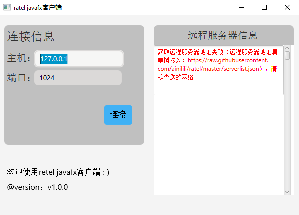
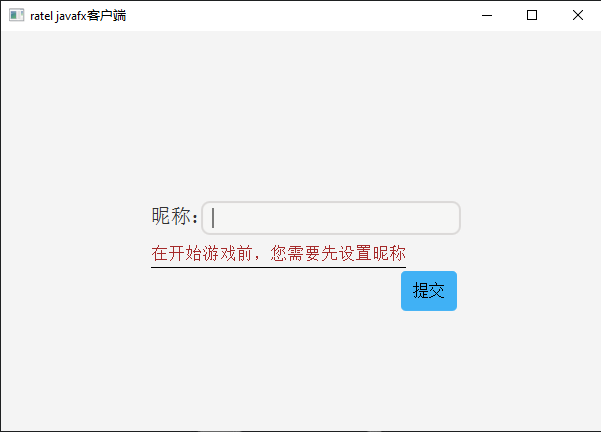
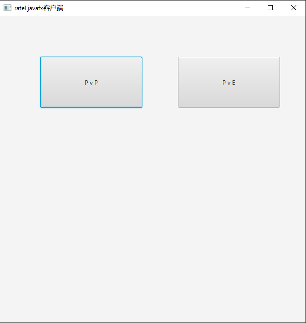
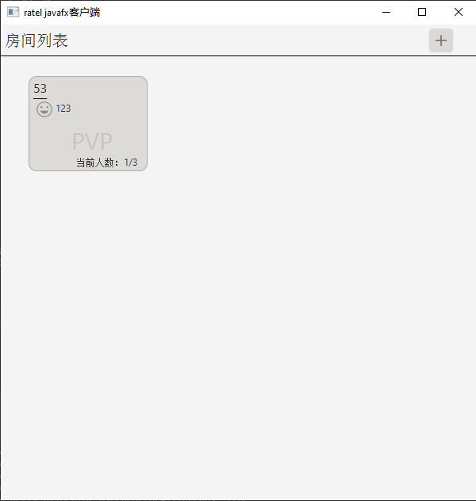
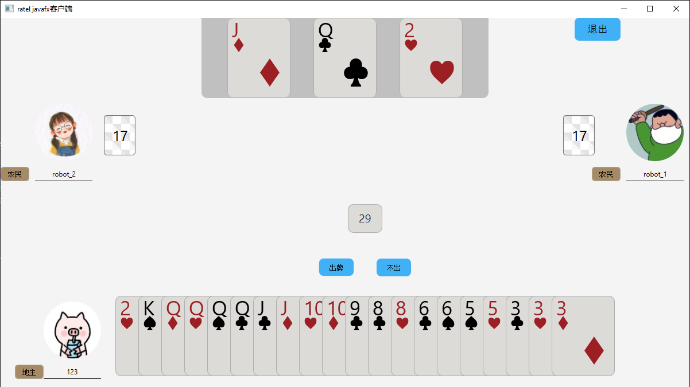

## 介绍
本项目是一个使用 `javafx` + `netty` 技术构建的一个桌面应用，
是对`ratel`应用命令行客户端的扩展，为`ratel`应用提供可视化界面操作方式。

### 系统架构
* 使用`netty`构建和**ratel**服务端的通讯
* 使用`javafx`构建`GUI`界面

## 快速启动
### 依赖
* `jdk`  
本项目是一个`java`应用，所以运行需要`java`环境，前往[oracle](https://www.oracle.com/java/technologies/java-downloads.html)下载最新版本jdk进行安装

* `maven`  
本项目由maven构建，构建本应用需要先安装maven，前往[apache maven](https://maven.apache.org)下载最新版本maven进行安装

### 安装
```powershell
git clone https://github.com/ainilili/ratel.git
cd ratel
mvn install package
```
#### 启动服务器
```shell
java -jar landlords-server/target/landlords-server-#{version}.jar -p 1024
```

#### 启动`javafx`客户端
```shell
java -jar landlords-client-javafx/target/landlords-client-javafx-#{version}.jar
```

## 使用
1. 选择服务器地址连接
  
2. 输入昵称
  
3. 选择模式
  
4. 选择房间
  
5. 开始游戏
  

## TODO List
-[X] PVE模式  
-[] PVP模式  
-[] 优化界面    
-[] 页面切换  
-[] 挂机检测

## 反馈
如果你发现此客户端的bug或有任何疑问，欢迎提[issue](https://github.com/ainilili/ratel/issues)，
或者你也可以直接联系我（[zhangxunweia@gmail.com](zhangxunweia@gmail.com)）

## 参考
* [NaiveChat](https://github.com/fuzhengwei/NaiveChat)
* [ratel部分协议](https://github.com/ainilili/ratel/blob/master/PROTOCO_CN.md)
* [javafx和netty之间的通信](https://github.com/ainilili/ratel/landlords-client-javafx/javafx-netty-communication.md)