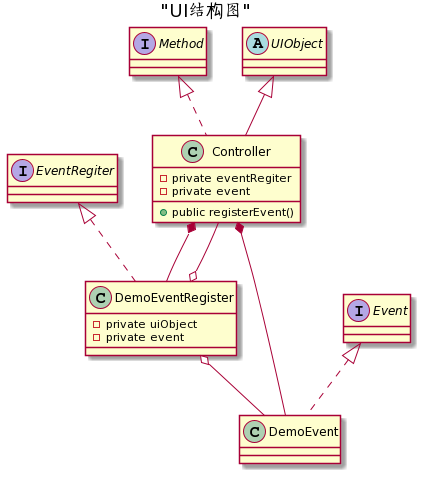

## 页面如何将用户信息传递给服务端
### UI组件的介绍
* `UIObject`：继承于`Stage`的一个抽象类，用于用户视图扩展
* `Controller`：基础于`UIObject`，代表一个自定义视图
* `Method`：定义视图上可以进行的操作
* `EventRegister`：用于视图上元素的事件注册
* `IEvent`：定义事件可以进行的操作

### ui类结构
  
1. `Controller`通过`EventRegister`进行页面元素的事件注册  
2. `EventRegister`将`IEvent`注册为页面元素上的事件回调函数
3. `IEvent`的实现类`DemoEvent`可以操纵`channel`和`netty`服务端进行通信

以上组件的简单流程图如下：  
```
// 注册元素事件
controller -> init -> EventRegister.registerEvent -> element.setOnAction
  
// 元素事件响应
elemnt -> onAction -> event -> channel -> netty server
```

### 示例
场景：编写一个页面，点击页面上的退出按钮向`netty`服务端发送退出房间信号  
  
1. 编写一个`demo.fxml`视图文件
```fxml
<AnchorPane xmlns="http://javafx.com/javafx/8" xmlns:fx="http://javafx.com/fxml/1">
   <children>
      <Button fx:id="quitButton">退出房间</Button>
   </children>
</AnchorPane>    
```
2. 编写一个`Controller`用于视图展示
```java
public class Controller extends UIObject implements Method {
    private IEvent event;
    private EventRegister demoEventRegister;

     public Controller(IEvent event) throws IOException {
        super();

        // 加载fxml视图文件
        root = FXMLLoader.load(getClass().getClassLoader().getResource("demo.fxml"));
        setScene(new Scene(root));

        this.roomEvent = roomEvent;

        // 注册元素事件
        registerEvent();
    }
    
    @Override
    public void registerEvent() {
        demoEventRegister = new DemoEventRegister(this, event);
    }
}
```  
3. 编写一个`Event`用于事件处理
```java
public interface Event {
    void quit();
}

public class DemoEvent implements Event {
    @Override
    public void quit() {
        // 获取channel，通过工具类向netty服务端发送退出房间信号
        Channel channel = BeanUtil.getBean("channel");
        ChannelUtil.pushToServer(channel, ServerEventCode.CODE_CLIENT_EXIT, null);
    }
}
```  
4. 编写一个`EventDefiner`用于页面元素事件注册
```java
public class DemoEventRegister implements EventRegister {

    private UIObject uiObject;
    private IEvent event;

    public DemoEventRegister(UIObject uiObject, IEvent event) {
        this.uiObject = uiObject;
        this.event = event;

        registerEvent();
    }

    @Override
    public void registerEvent() {
        quitRoom();
    }
    
    private void quitRoom() {
        // 为退出按钮设置点击事件回调函数
        uiObject.$("#quitButton", Button.clas).setOnAction(e -> event.quit());
    }
}
```

## 服务端如何将信息传递给页面
如果您还不清楚`netty`服务端和`netty`客户端之间的事件通信，请先阅读[ratel部分协议](https://github.com/ainilili/ratel/blob/master/PROTOCO_CN.md)。  

### 编写客户端事件监听器
编写自己的事件监听器，设置感兴趣的服务端事件编码，当对应事件出现时，会执行事件监听器中的代码。实现`ClientListener`或者继承`AbstractClientListener`编写自己的客户端事件监听器：
```java
public class ClientExitListener extends AbstractClientListener {

    public ClientExitListener() {
        // 设置感兴趣的服务端事件编码（CODE_CLIENT_EXIT 客户端退出事件编码）
        super(ClientEventCode.CODE_CLIENT_EXIT);
    }

    /**
     * 事件处理业务
     * @param channel   客户端通信channel
     * @param json      事件数据
     */
    @Override
    public void handle(Channel channel, String json) {
        // do something ...
    }
}
```

### 在客户端事件监听器中改变页面
每一个客户端事件监听器中都有`uiService`属性，通过`uiService`可以获取各个`Method`对页面进行操作：
```java
@Override
public void handler(Channel channel, String json) {
    Method method = uiService.getMethod(Controller.METHOD_NAME);
    
    // 一定要在javafx线程中进行视图的更改
    Platform.runLater(() -> method.updateView(json));
}
```

### 示例  
场景：客户端退出后服务端向客户端发送退出成功事件响应，客户端接收事件后弹出弹框提示退出成功。
1. 编写一个`Method`定义视图的弹出弹框行为
```java
public interface Method {
    void alert(String message);
}

public class Controller extends UIObject implements Method {
    private static final String METHOD_NAME = "method";

    @Override
    public void alert(String message) {
        Alert alert = new Alert(Alert.AlertType.INFORMATION);
        alert.setContentText(message);
        alert.showAndWait();
    } 
}
```
2. 编写一个客户端事件监听器
```java
public class ClientExitListener extends AbstractClientListener {

    public ClientExitListener() {
        // 设置感兴趣的服务端事件编码（CODE_CLIENT_EXIT 客户端退出事件编码）
        super(ClientEventCode.CODE_CLIENT_EXIT);
    }

    /**
     * 事件处理业务
     * @param channel   客户端通信channel
     * @param json      事件数据
     */
    @Override
    public void handle(Channel channel, String json) {
        Method method = uiService.getMethod(Controller.METHOD_NAME);
        
        Platform.runLater(() -> method.alert(json));
    }
}
```